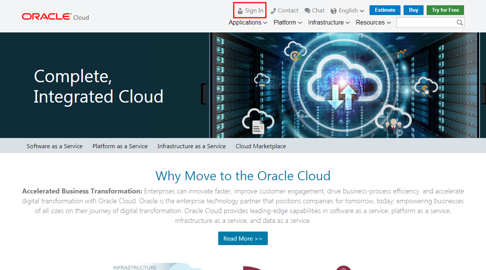
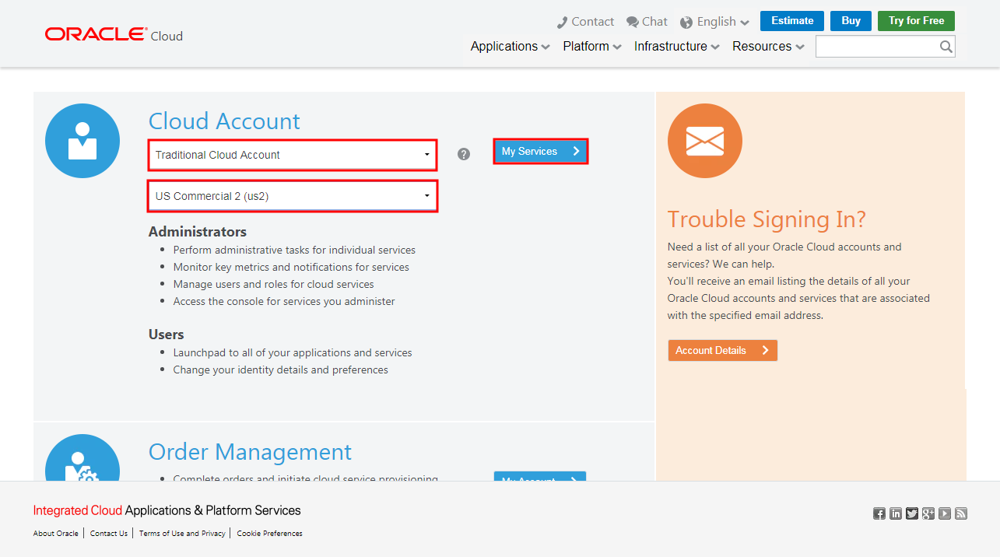
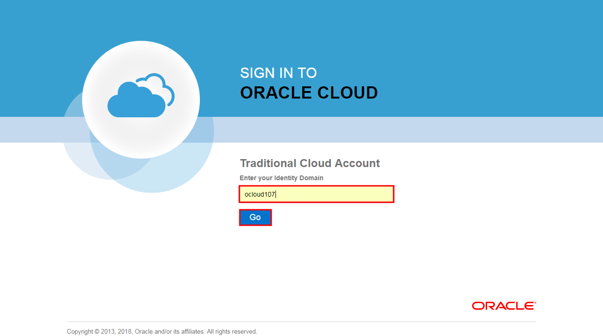
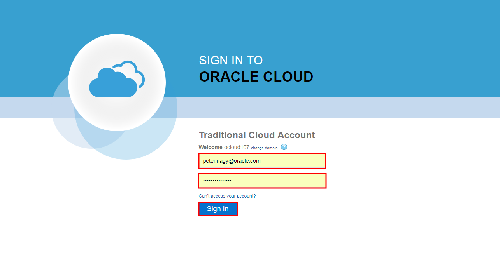
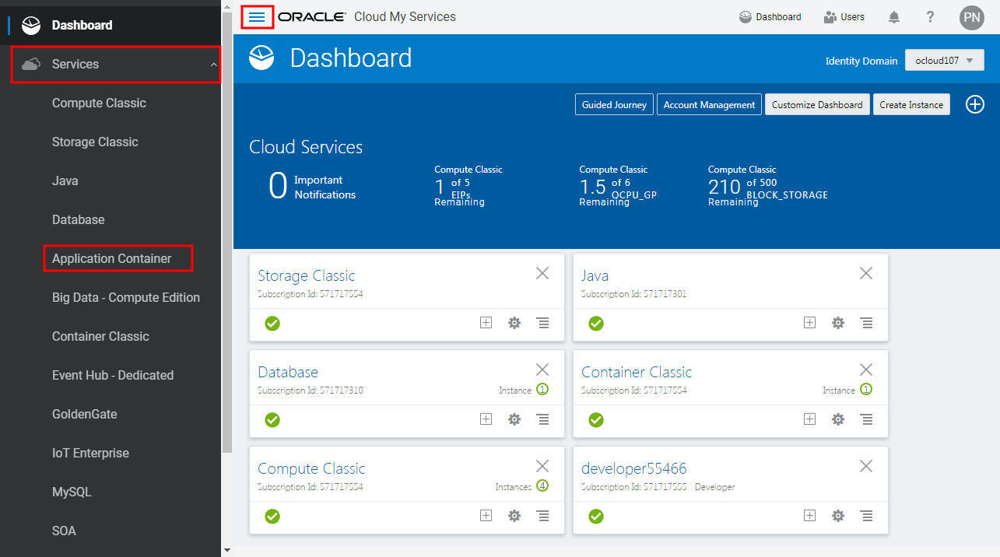
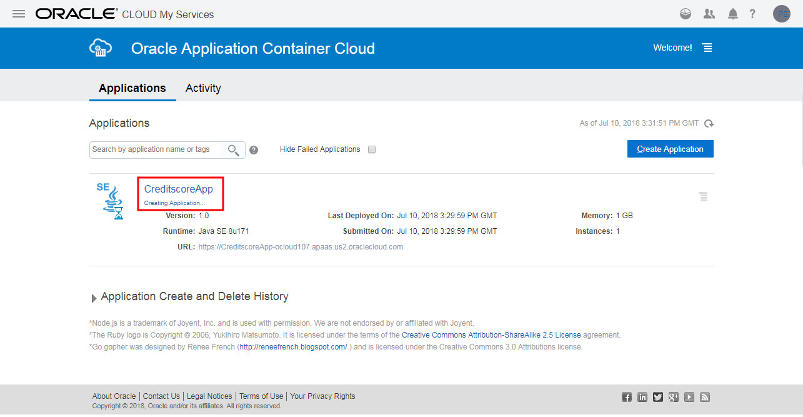
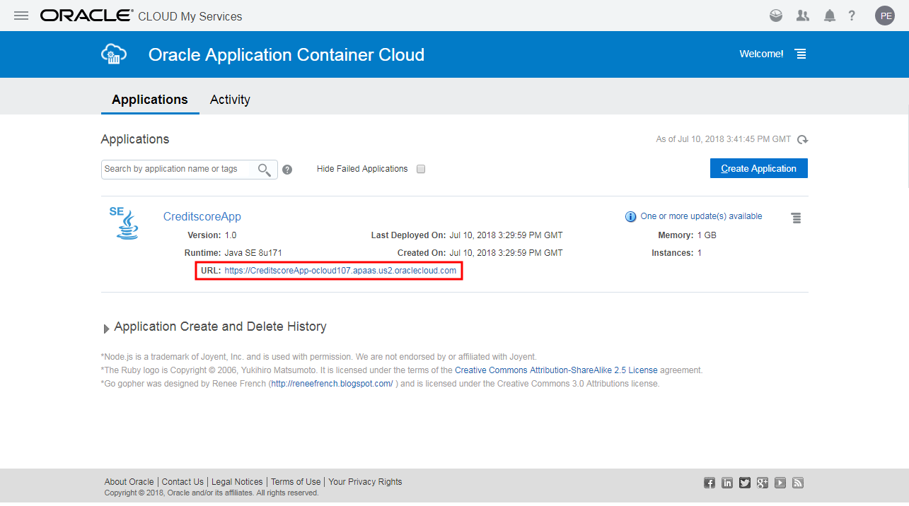
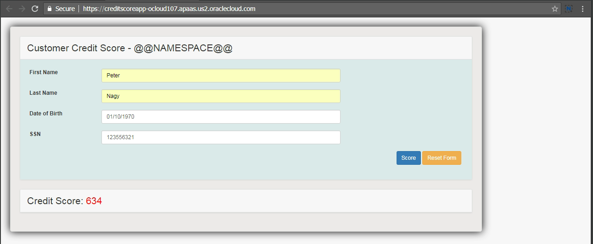

## Deploy Creditscore demo application to Application Container Cloud Services from a Git Repository ##

### About this tutorial ###
**Oracle Application Container Cloud Service** lets you deploy Java SE, Node.js, PHP, Python, Ruby, Go, and .NET Core applications to the Oracle Cloud. You can also deploy Java EE web applications. Your application runs in a Docker container.

Oracle Application Container Cloud Service GitHub integration allows you to [deploy your applications directly from GitHub](https://docs.oracle.com/en/cloud/paas/app-container-cloud/dvcjv/preparing-application-stored-github-deployment.html). Applications are deployed using the Oracle command line interface or REST API.

This tutorial demonstrates how to deploy application from Git repository using REST API.

### Prerequisites ###

- An Oracle Cloud account with access to an instance of Oracle Application Container Cloud Service
- Shell to execute cURL commands

----
#### Deploying Using the REST API ####

To deploy your web application from Git Repository you need to provide at least `manifest.json` on your desktop. This file specifies how to launch your application. Optionally, you can include the runtime version and other parameters. See more details about the [manifest.json metadata file in the documentation](https://docs.oracle.com/en/cloud/paas/app-container-cloud/dvcjv/creating-manifest-json-file.html).

Optionally you can define `deployment.json` which specifies how much memory to allocate to the application, how many application instances to create initially, additional environment variables, and service bindings to other Oracle Cloud services. If no values are specified or the file is omitted, then memory and instance defaults are used. This file is optional. See more details about the [deployment.json file in the documentation](https://docs.oracle.com/en/cloud/paas/app-container-cloud/dvcjv/creating-deployment-json-file.html).

In this tutorial you can download these metadata files directly from the demo application's repository. Execute the following cURL commands to download metadata files into your home directory.

	curl https://raw.githubusercontent.com/nagypeter/angular-java-creditscore/master/manifest.json -o ~/manifest.json
	curl https://raw.githubusercontent.com/nagypeter/angular-java-creditscore/master/deployment.json -o ~/deployment.json

!NOTE! When you use cURL in Windows environment keep in mind Windows use `\` (backslash) when you define `deployment.json` and `manifest.json` saving location.

Now you have everything to deploy Creditscore demo web application using the REST API. Replace the neccessary values in the following example to get your version of the cURL POST request  to deploy the application. This example assumes Linux based shell.

	curl -X POST -u <YOUR_ORACLE_CLOUD_USERNAME>:<YOUR_ORACLE_CLOUD_PASSWORD>\
	  https://apaas.us.oraclecloud.com/paas/service/apaas/api/v1.1/apps/<YOUR_ORACLE_CLOUD_IDENTITY_DOMAIN> \
	  -H "X-ID-TENANT-NAME:<YOUR_ORACLE_CLOUD_IDENTITY_DOMAIN>" \
	  -H "Cache-Control: no-cache" \
	  -H "content-type: multipart/form-data;"  \
	  -F "name=CreditscoreApp" \
	  -F "runtime=java" \
	  -F "subscription=HOURLY" \
	  -F "deployment=@Local-path-to-deployment-json/deployment.json" \
	  -F "manifest=@Local-path-to-manifest-json/manifest.json" \
	  -F "gitRepoUrl=https://github.com/nagypeter/angular-java-creditscore.git"

!NOTE! When you use cURL in Windows environment please replace the line break `\` characters appropiately or create a single line command. Also keep in mind Windows use `\` (backslash) when you define `deployment.json` and `manifest.json` location. The best is to run cURL command from the directory where you saved `deployment.json` and `manifest.json` and avoid to define the full path to the files.

(Known bugs. In case of Windows (8.1 especially) cURL if you get **Bad Request** response remove `-H "content-type: multipart/form-data;"` parameter.)

In case if you need to use private repository provide *gitUserName* and *gitPassword* parameters.

Replacing the necessary parameters and executing the request you should get a similar response:

	[oracle@localhost ~]$ curl -X POST -u peter.nagy@oracle.com:password \
	> https://apaas.us.oraclecloud.com/paas/service/apaas/api/v1.1/apps/ocloud107 \
	>   -H "X-ID-TENANT-NAME:ocloud107" \
	>   -H "Cache-Control: no-cache" \
	>   -H "content-type: multipart/form-data;"  \
	>   -F "name=CreditscoreApp" \
	>   -F "runtime=java" \
	>   -F "subscription=HOURLY" \
	>   -F "deployment=@/home/oracle/deployment.json" \
	>   -F "manifest=@/home/oracle/manifest.json" \
	>   -F "gitRepoUrl=https://github.com/nagypeter/angular-java-creditscore.git"
	{"identityDomain":"ocloud107","appId":"2a86bf23-c86c-4573-8278-cb4cd1b55095","name":"CreditscoreApp","status":"NEW","createdBy":"peter.nagy@oracle.com","creationTime":"2018-07-10T15:29:59.433+0000","lastModifiedTime":"2018-07-10T15:29:59.422+0000","subscriptionId":"571717301","serviceEntitlementId":"571717764","subscriptionType":"MONTHLY","isClustered":false,"requiresAntiAffinity":false,"type":"web","region":"uscom-central-1","instances":[],"lastestDeployment":{"deploymentId":"29f9c14b-07b5-439e-ae87-babd2010f1ff","deploymentStatus":"READY","deploymentURL":"https://apaas.us.oraclecloud.com/paas/service/apaas/api/v1.1/apps/ocloud107/CreditscoreApp/deployments/29f9c14b-07b5-439e-ae87-babd2010f1ff"},"currentOngoingActivity":"Creating Application","appURL":"https://apaas.us.oraclecloud.com/paas/service/apaas/api/v1.1/apps/ocloud107/CreditscoreApp","message":[],"availableUpdates":[],"tags":[],"gitRepoURL":"https://github.com/nagypeter/angular-java-creditscore.git","autoscalingEnabled":false}

If your response contains `deploymentId` and `deploymentStatus="READY"` values than your request was successfully accepted.

Open a browser visit [https://cloud.oracle.com](https://cloud.oracle.com) and click **Sign In**.

Select your account type and datacenter. Click **My Services**.

Enter your identity domain. Click **Go**.

Enter your Oracle Cloud Account credentials. Click **Sign In**.

On the dashboard click the hamburger menu icon and open **Services** list. Select **Application Container** console.

Most likely on the console you see the CreditscoreApp application is still being created.

After a short time the appication have to be ready. This time the URL is enabled. Click the application URL top open.

Test the application. Enter the required values and click **Score**.

